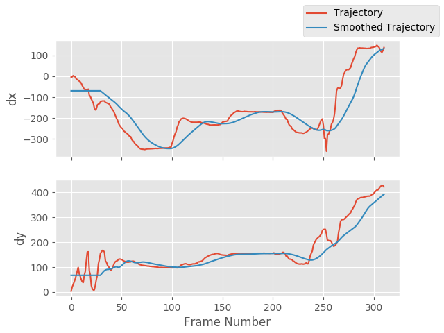
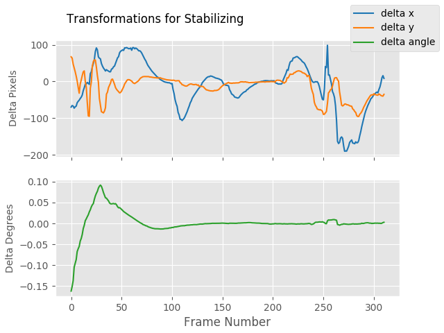

# Python Video Stabilization

-red.svg)

 Python video stabilization using OpenCV. 
 
 This module contains a single class (`VidStab`) used for video stabilization. This class is based on the work presented by Nghia Ho in [SIMPLE VIDEO STABILIZATION USING OPENCV](http://nghiaho.com/?p=2093). The foundation code was found in a comment on Nghia Ho's post by the commenter with username koala.
 
 Input                           |  Output
:-------------------------------:|:-------------------------:
    |  
 
### Installation

> ```diff
> - Warning: Code still in development. 
> - If you install: expect 🐛s and interface is subject to change
> ```

Currently only available from this repo.  Plan to publish to pypi once stable.

##### From repo

<sub>replace pip3 with pip if using python 2</sub>

```bash
pip3 install git+https://github.com/AdamSpannbauer/python_video_stab.git
```

### Example Usage

The `VidStab` class can be used as a command line script or in your own custom python code.

#### Using from command line

```bash
# Using defaults
python3 -m vidstab --input input_video.mov --output stable_video.avi
```

```bash
# Using a specific keypoint detector
python3 -m vidstab -i input_video.mov -o stable_video.avi -k GFTT
```

#### Using `VidStab` class

```python
from vidstab import VidStab

# Using defaults
stabilizer = VidStab()
stabilizer.stabilize(input_path='input_video.mov', output_path='stable_video.avi')

# Using a specific keypoint detector
stabilizer = VidStab(kp_method='ORB')
stabilizer.stabilize(input_path='input_video.mp4', output_path='stable_video.avi')

# Using a specific keypoint detector and customizing keypoint parameters
stabilizer = VidStab(kp_method='FAST', threshold=42, nonmaxSuppression=False)
stabilizer.stabilize(input_path='input_video.mov', output_path='stable_video.avi')
```

#### Plotting frame to frame transformations

```python
from vidstab import VidStab
import matplotlib.pyplot as plt

stabilizer = VidStab()
stabilizer.stabilize(input_path='input_video.mov', output_path='stable_video.avi')

stabilizer.plot_trajectory()
plt.show()

stabilizer.plot_transforms()
plt.show()
```

Trajectories                     |  Transforms
:-------------------------------:|:-------------------------:
  |  

#### Using borders

```python
from vidstab import VidStab

stabilizer = VidStab()

# black borders
stabilizer.stabilize(input_path='input_video.mov', 
                     output_path='stable_video.avi', 
                     border_type='black')
stabilizer.stabilize(input_path='input_video.mov', 
                     output_path='wide_stable_video.avi', 
                     border_type='black', 
                     border_size=100)

# filled in borders
stabilizer.stabilize(input_path='input_video.mov', 
                     output_path='ref_stable_video.avi', 
                     border='reflect')
stabilizer.stabilize(input_path='input_video.mov', 
                     output_path='rep_stable_video.avi', 
                     border='replicate')
```

`border_size=0`                  |  `border_size=100`
:-------------------------------:|:-------------------------:
   |  

`border='reflect'`                      |  `border='replicate'`
:--------------------------------------:|:-------------------------:
  |  
